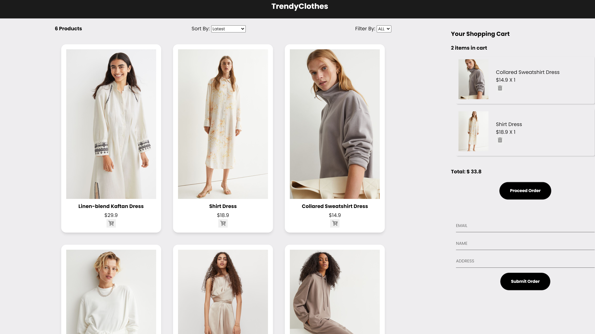

<h1 align="center"> eCommerce App   (React) </h1>

<i> React, Redux based e-commerce SPA(Single Page Application), with shopping cart, product filter & sort feature</i>

## Table of Contents

- [Live Demo](#live-demo)
- [Description](#description)
- [Tech Stack](#tech-stack)
- [Key Features](#key-features)
- [Project Setup](#project-setup)
- [Future Scope](#future-scope)

## Live Demo

<h2 align="center"><a  href="https://ll-react-ecomm-app.netlify.app/">Live Demo Link</a></h2>

|                                              Mobile View                                              |                                       Tablet View                                        |
| :---------------------------------------------------------------------------------------------------: | :--------------------------------------------------------------------------------------: |
|  |  |

## Description

A React, Redux based eCommerce SPA(Single Page Application), with shopping cart, product filter & sort feature, buyer and order information is able to be submitted to a backend.
The app is deployed on Netlify

<!-- =============================================== -->

## Tech Stack

#### Frontend:

- React.js,
- Redux
- React modal
- Font awesome

#### Development:

- GIT - for version control
- Bash - for CLI
- NPM - for package managing
<!-- =============================================== -->

## Key Features

- Filter items by size
- Sort items by price
- Add/delete product in shipping cart
- Order and buyer information submit
- React modal to show item details
- Responsive design

## Project Setup

1. In root directory, run "npm install".
2. Then run "npm start".

## Future Scope

- Add pagination feature
- Add search product feature
